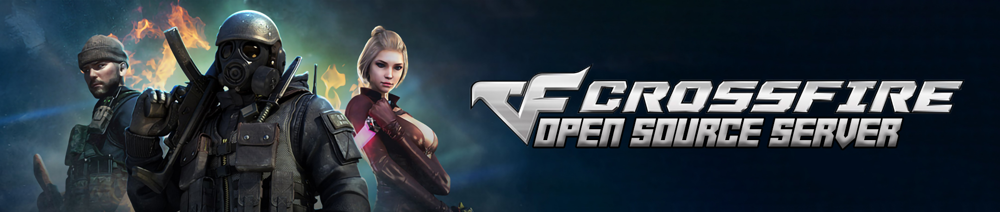

[English](README.md) | Português

# CrossFire Emulator (Versão Java)
**Olá a todos!** Este é um **projecto ambicioso**, temos ainda muitos objetivos a atingir e gostaríamos de **apreciar** qualquer ajuda que nos é fornecido. Estamos felizes por disponibilizar o **código fonte** do nosso servidor, muitos dos Enum já criados estão na ordem correta e com a sua correta escrita para enviar os packets. Utilize o servidor como desejar, não temos restrições desde que atribua os créditos deste repositório.

## Visão geral
Isto é um projeto que está a ser desenvolvida pela comunidade, e não está afiliado a nenhuma das empresas pertencentes à [Neowiz](https://www.neowiz.com/), [Playgra (Arario)](http://playgra.com/), [VTC Game](https://www.vtcgame.vn/), [Tencent](https://www.tencent.com/), [Z8Games](https://www.z8games.com/), [GameClub](https://www.gameclub.ph/) and [LYTO](https://www.lytogame.com/). O projeto é desenvolvido com o Java versão 8 possibilitando que seja possível executar em maioria dos servidores de hoje em dia, e com a ferramenta de automação de compilação chamada Maven.

## Autenticação no servidor de Login
O projeto ainda não tem qualquer tipo de gestão de bases de dados ou simuladores, o mesmo para simular o servidor de login, utilizamos dados estáticos para efeitos de testes. Mais tarde, será implementada toda uma interface para este tipo de gestão.

Abaixo estão os dados para efetuar a autenticação.

| |LOGIN|PASSWORD|
|---|---|---|
|Conta|`oreki`|`oreki`

## UML Diagrams
Um pequeno esquema sobre a network do servidor.

